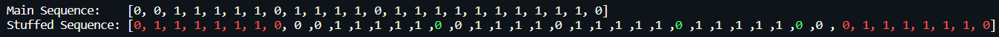

# Python library to perform __Bit Stuffing__ and __Byte Stuffing__

## 1. Bit Stuffing usage example.

```PYTHON
from stuffing.BitStuffing import BitStuffing
from stuffing.cls import cls

stuff = BitStuffing() # INITIALLISE THE CLASS
stuff.stuff() # START STUFFING

cls() # CLEAR SCREEN

# PRINT SEQUENCES TO SCREEN
print("Main Sequence:    {}".format(stuff.sequence))
print("Stuffed Sequence: {}\n\n".format(stuff.getStuffedColored()))
```

### Explanation
1. Inititallise the class `BitStuffing()` You can pass the bit sequence to the class as a list.
  - `BitStuffing([0,0,1,1,1,1,1,0,1,1,1,1,0,1,1,1,1,1,1,1,1,1,1,0])`
  - If nothing is passed on to the class, you will be prompted for input.
2. Start the bit stuffing by calling the `.stuff()` method.
3. The input sequence is obtained as `.sequence` object.
4. The bit stuffed sequence is available as the `.stuffed` object.
5. The `.getStuffedColored()` returns the stuffed sequence along with the added flags, when printed, explicitly differentiates between the colors of the main sequence, bits stuffed and the flag.


---

## 2. Byte Stuffing usage example.